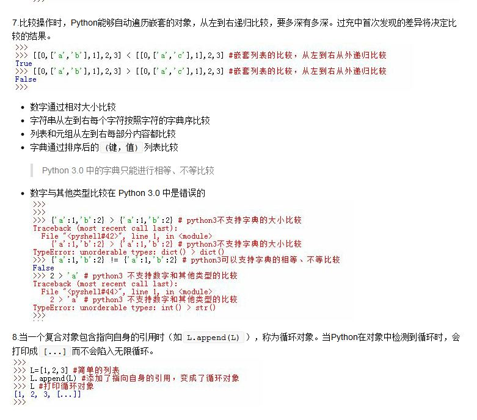

# python_learning_notes

《learning python》中文第四版的学习笔记，由纸值文档转换而来。看这份笔记的时候最好有 C|C++ 的经验。这份笔记的特点：

1. 减少了《learning python》这本书里面很多罗哩罗嗦的话，是一份总结

2. 对于大多数的条款，都给出了 Python IDLE 运行效果。其中运行环境为：  
	* win7 64bit professional
	* Python 3.5 64 bit  

